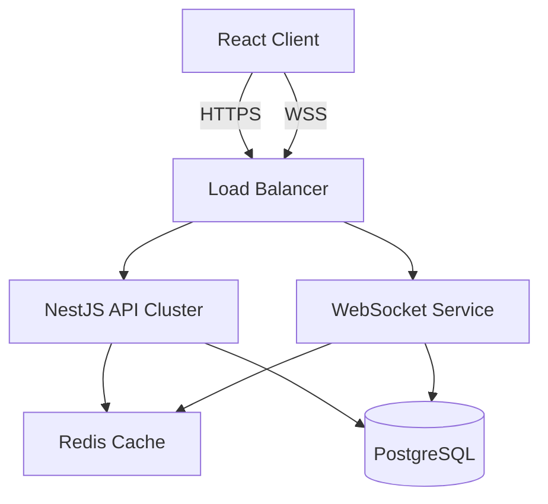

# Backend Architecture Recommendation

To build a backend that can **withstand high load**, handle real-time chat, and manage financial/sales data securely for **Stockbud**, I recommend the following technology stack.

## 1. The Core Stack: Node.js (TypeScript) + NestJS

**Why?**
*   **Scalability**: NestJS is built with a modular architecture (inspired by Angular) that enforces code organization, making it easy to scale from a monolith to microservices.
*   **Performance**: Node.js is excellent for I/O-heavy operations like handling thousands of concurrent chat connections and API requests.
*   **Ecosystem**: Full TypeScript support allows sharing types (DTOs/Interfaces) between your React frontend and backend, reducing bugs.

### Essential Components:
*   **Framework**: [NestJS](https://nestjs.com/)
*   **Language**: TypeScript
*   **API Interface**: REST (for standard CRUD) + GraphQL (optional, for flexible dashboard data fetching).

---

## 2. Database: PostgreSQL

**Why?**
*   **Data Integrity**: Financial and sales data require ACID compliance (strict consistency), which SQL databases like Postgres guarantee.
*   **Flexibility**: Postgres supports JSONB, allowing you to store unstructured data (like complex bot configurations or chat logs) alongside structured data.
*   **Scalability**: Supports partitioning and clustering for high load.

---

## 3. High-Speed Caching: Redis

**Critical for "Withstanding Load":**
*   **Session Management**: Store user sessions and auth tokens for fast access.
*   **Real-time Pub/Sub**: Use Redis to distribute WebSocket messages across multiple server instances (e.g., if you scale your backend to 10 servers, Redis helps them talk to each other).
*   **Traffic Spikes**: Cache expensive dashboard queries (e.g., "Total Revenue") so you don't hit the main database for every page load.

---

## 4. Real-Time Engine: Socket.io

**Why?**
*   Required for the **Bot Chat** and **Real-time Status** features.
*   Handles reconnection logic, room management (for private chats), and fallbacks automatically.

---

## 5. Infrastructure & Load Handling (DevOps)

To ensuring the system withstands load:

1.  **Docker**: Containerize the application for consistent deployment.
2.  **Kubernetes (K8s) or AWS ECS**: For orchestration. Auto-scale functionality:
    *   *If CPU usage > 70%, automatically spin up 5 more backend servers.*
3.  **Load Balancer (Nginx / AWS ALB)**: Distribute incoming traffic evenly across your servers.

---

## Summary Diagram

## Alternative: Go (Golang)
If you anticipate **extremely** high computational load (e.g., millions of complex calculations per second), **Go (with Gin or Echo)** is a viable alternative to Node.js due to its raw performance and concurrency model (Goroutines). However, for most SaaS/Dashboard apps, Node.js is sufficiently fast and faster to develop.
