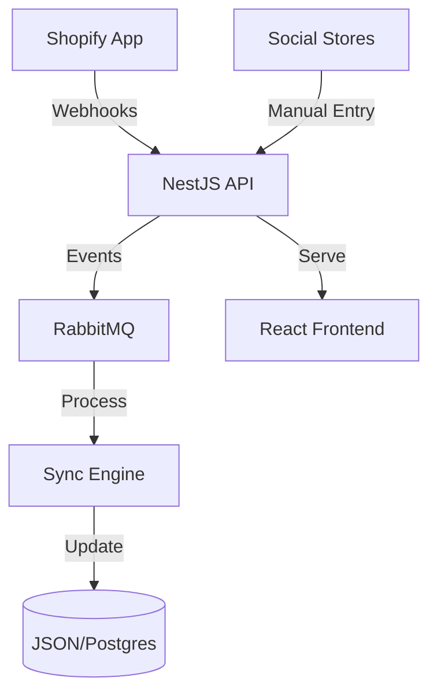

# System Architecture

Stockbud is built on a modular, event-driven architecture designed for high scalability and real-time data synchronization.

## High-Level Diagram

## Key Components

### 1. The Backend OS (NestJS)
The core API that manages orchestration, authentication, and the JSON-based persistence layer (for Platform) or PostgreSQL (for Production).

### 2. Shopify Integration (Remix/React Router)
A dedicated app that runs within the Shopify Admin, handling OAuth and real-time catalog syncing.

### 3. Order Processor
A microservice that consumes events from RabbitMQ to handle complex business logic like inventory deduction across multiple storefronts.

### 4. Image Service
A specialized service for optimizing and serving product images across different storefront themes.
